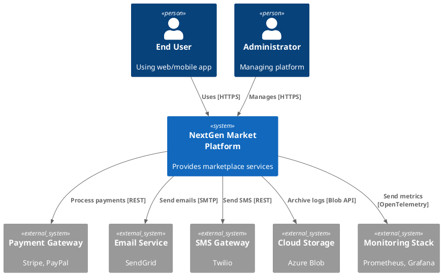
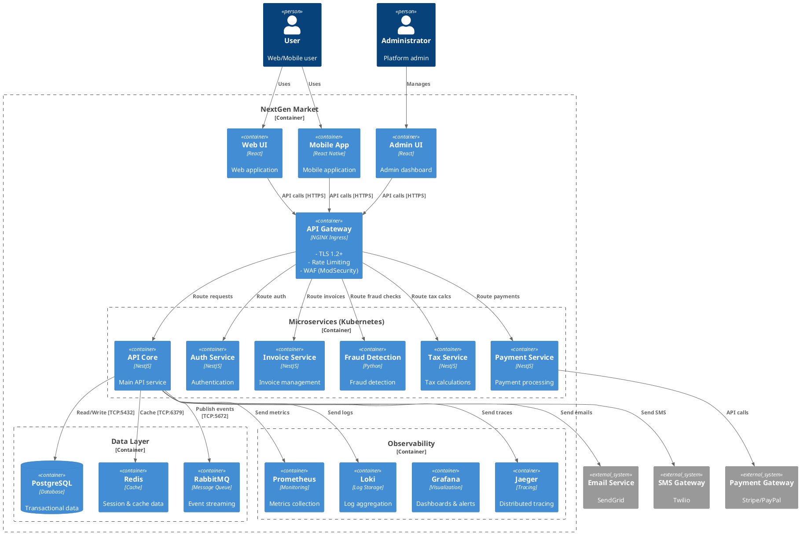
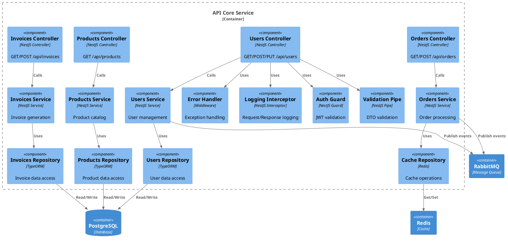
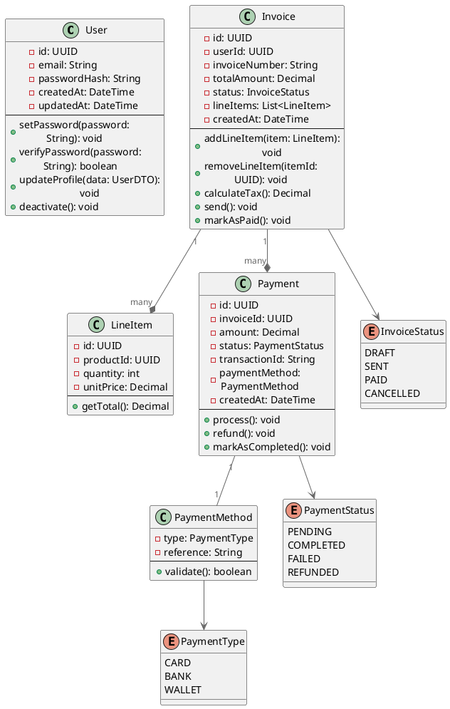

# 🏗️ C4 Architecture Diagrams - System Design Visualization

Enterprise-grade architecture documentation using C4 Model (Level 0-3) with PlantUML/Mermaid diagrams.

---

## C4 Model Overview

```
Level 0: System Context (Big Picture)
  └─ Actors, External Systems, Data Flow

Level 1: Container Diagram (Technical Boundaries)
  └─ Services, Databases, Message Queues, APIs

Level 2: Component Diagram (Inside Services)
  └─ Controllers, Services, Repositories, Business Logic

Level 3: Code Diagram (Classes, Methods)
  └─ Class hierarchy, dependencies, interfaces
```

---

## Level 0: System Context Diagram

```
┌────────────────────────────────────────────────────────────────────┐
│                     NextGen Market Platform                         │
│                                                                    │
│  ┌────────────────────────────────────────────────────────────┐  │
│  │  NextGen-Market System                                     │  │
│  │                                                            │  │
│  │  ┌──────────────────────────────────────────────────┐    │  │
│  │  │  API Platform                                   │    │  │
│  │  │  (NestJS, TypeScript)                          │    │  │
│  │  │                                                 │    │  │
│  │  │  - REST APIs                                   │    │  │
│  │  │  - Real-time WebSocket                         │    │  │
│  │  │  - Event Processing                            │    │  │
│  │  └──────────────────────────────────────────────────┘    │  │
│  │                        ↓↑                                  │  │
│  │  ┌──────────────────────────────────────────────────┐    │  │
│  │  │  Data Layer                                     │    │  │
│  │  │  - PostgreSQL (transactional)                   │    │  │
│  │  │  - Redis (caching, sessions)                    │    │  │
│  │  │  - Elasticsearch (full-text search)             │    │  │
│  │  └──────────────────────────────────────────────────┘    │  │
│  └────────────────────────────────────────────────────────────┘  │
│         ↓↑              ↓↑              ↓↑              ↓↑       │
└────┬─────┬──────────────┬──────────────┬──────────────┬──────────┘
     │     │              │              │              │
     ↓ ← → ↓          ← → ↓          ← → ↓          ← → ↓
    ╔═════════════╗  ╔═════════════╗  ╔═════════════╗  ╔═════════════╗
    ║   Web App   ║  ║ Mobile App  ║  ║   Admin     ║  ║  External   ║
    ║  (React)    ║  ║ (React Native)║  ║   Panel     ║  ║   Partners  ║
    ║             ║  ║             ║  ║   (React)   ║  ║   (REST)    ║
    ╚═════════════╝  ╚═════════════╝  ╚═════════════╝  ╚═════════════╝
    Users (B2C)    Users (B2C Mobile) Admins (B2B)   Third-party APIs

External Systems:
  - Payment Gateway (Stripe, PayPal)
  - Email Service (SendGrid)
  - SMS Gateway (Twilio)
  - Audit Log Storage (Azure Blob)
  - Monitoring (Prometheus, Grafana)
```

### PlantUML C0 Diagram



---

## Level 1: Container Diagram

```
┌─────────────────────────────────────────────────────────────────────────────┐
│                        NextGen Market Platform                              │
│  ┌─────────────────────────────────────────────────────────────────────┐   │
│  │                        User Interface                              │   │
│  │  ┌──────────────┐  ┌──────────────┐  ┌──────────────────┐        │   │
│  │  │  Web UI      │  │  Mobile App  │  │  Admin Dashboard │        │   │
│  │  │  (React)     │  │  (React Nat.)│  │  (React)         │        │   │
│  │  │  Port: 3000  │  │  Port: 3001  │  │  Port: 3002      │        │   │
│  │  └──────────────┘  └──────────────┘  └──────────────────┘        │   │
│  │         ↓↑                ↓↑                 ↓↑                     │   │
│  │  ┌────────────────────────────────────────────────────┐           │   │
│  │  │         API Gateway & Load Balancer               │           │   │
│  │  │         (NGINX Ingress)                           │           │   │
│  │  │         - TLS 1.2+                                 │           │   │
│  │  │         - Rate Limiting (100 req/s)               │           │   │
│  │  │         - WAF (ModSecurity)                        │           │   │
│  │  │         - Blue-Green/Canary Deployment            │           │   │
│  │  └────────────────────────────────────────────────────┘           │   │
│  │         ↓↑                                                          │   │
│  │  ┌────────────────────────────────────────────────────┐           │   │
│  │  │              API Microservices                    │           │   │
│  │  │  ┌──────────────┐  ┌──────────────┐             │           │   │
│  │  │  │ API Core     │  │ Invoice Mgmt │             │           │   │
│  │  │  │ Service      │  │ Service      │             │           │   │
│  │  │  │ (3000)       │  │ (3001)       │             │           │   │
│  │  │  └──────────────┘  └──────────────┘             │           │   │
│  │  │  ┌──────────────┐  ┌──────────────┐             │           │   │
│  │  │  │ Auth Service │  │ Fraud        │             │           │   │
│  │  │  │ (3002)       │  │ Detection    │             │           │   │
│  │  │  │              │  │ (3003)       │             │           │   │
│  │  │  └──────────────┘  └──────────────┘             │           │   │
│  │  │  ┌──────────────┐  ┌──────────────┐             │           │   │
│  │  │  │ Tax Service  │  │ Payment      │             │           │   │
│  │  │  │ (3004)       │  │ Service      │             │           │   │
│  │  │  │              │  │ (3005)       │             │           │   │
│  │  │  └──────────────┘  └──────────────┘             │           │   │
│  │  └────────────────────────────────────────────────────┘           │   │
│  │         ↓↑                   ↓↑                   ↓↑             │   │
│  │  ┌──────────────┐  ┌──────────────┐  ┌──────────────┐          │   │
│  │  │ PostgreSQL   │  │ Redis Cache  │  │ RabbitMQ    │          │   │
│  │  │ (Transact.)  │  │ (Session)    │  │ (Events)    │          │   │
│  │  │ Port: 5432   │  │ Port: 6379   │  │ Port: 5672  │          │   │
│  │  └──────────────┘  └──────────────┘  └──────────────┘          │   │
│  │         ↓↑                                                       │   │
│  │  ┌────────────────────────────────────────────────┐            │   │
│  │  │     Observability Stack                       │            │   │
│  │  │  - Prometheus (metrics)                       │            │   │
│  │  │  - Grafana (visualization)                    │            │   │
│  │  │  - Loki (logs)                                 │            │   │
│  │  │  - Jaeger (tracing)                            │            │   │
│  │  │  - AlertManager (alerting)                     │            │   │
│  │  └────────────────────────────────────────────────┘            │   │
│  └─────────────────────────────────────────────────────────────────┘   │
│         ↓↑              ↓↑              ↓↑                             │
└─────────┬───────────────┬───────────────┬──────────────────────────────┘
          │               │               │
       External APIs: Payment Gateway, Email Service, SMS Gateway
```

### PlantUML C1 Diagram



---

## Level 2: Component Diagram (API Core Service)

```
┌──────────────────────────────────────────────────────────────────┐
│                    API Core Service (NestJS)                    │
│                                                                 │
│  ┌────────────────────────────────────────────────────────────┐│
│  │              REST Controllers                             ││
│  │  ┌──────────────────┐  ┌──────────────────┐              ││
│  │  │ UsersController  │  │ InvoicesController│              ││
│  │  │ /api/users       │  │ /api/invoices    │              ││
│  │  │ GET, POST, PUT   │  │ GET, POST, PUT   │              ││
│  │  └──────────────────┘  └──────────────────┘              ││
│  │  ┌──────────────────┐  ┌──────────────────┐              ││
│  │  │ ProductsControl. │  │ OrdersController │              ││
│  │  │ /api/products    │  │ /api/orders      │              ││
│  │  │ GET, POST, PUT   │  │ GET, POST, PUT   │              ││
│  │  └──────────────────┘  └──────────────────┘              ││
│  └────────────────────────────────────────────────────────────┘│
│           ↓↑                                                    │
│  ┌────────────────────────────────────────────────────────────┐│
│  │              Business Logic Services                       ││
│  │  ┌──────────────────┐  ┌──────────────────┐              ││
│  │  │ UserService      │  │ InvoiceService   │              ││
│  │  │ - Register       │  │ - Create invoice │              ││
│  │  │ - Authenticate   │  │ - Calculate tax  │              ││
│  │  │ - Manage profile │  │ - Send email     │              ││
│  │  └──────────────────┘  └──────────────────┘              ││
│  │  ┌──────────────────┐  ┌──────────────────┐              ││
│  │  │ PaymentService   │  │ ProductService   │              ││
│  │  │ - Process payment│  │ - List products  │              ││
│  │  │ - Refund         │  │ - Search products│              ││
│  │  │ - Validate card  │  │ - Get details    │              ││
│  │  └──────────────────┘  └──────────────────┘              ││
│  └────────────────────────────────────────────────────────────┘│
│           ↓↑                                                    │
│  ┌────────────────────────────────────────────────────────────┐│
│  │              Data Access Layer (Repositories)              ││
│  │  ┌──────────────────┐  ┌──────────────────┐              ││
│  │  │ UserRepository   │  │ InvoiceRepository│              ││
│  │  │ - Find by ID     │  │ - Find by ID     │              ││
│  │  │ - Create         │  │ - Create         │              ││
│  │  │ - Update         │  │ - Update         │              ││
│  │  │ - Delete         │  │ - Query list     │              ││
│  │  └──────────────────┘  └──────────────────┘              ││
│  │  ┌──────────────────┐  ┌──────────────────┐              ││
│  │  │ CacheRepository  │  │ ProductRepository│              ││
│  │  │ - Get from cache │  │ - Search         │              ││
│  │  │ - Set in cache   │  │ - Get details    │              ││
│  │  │ - Invalidate     │  │ - Bulk insert    │              ││
│  │  └──────────────────┘  └──────────────────┘              ││
│  └────────────────────────────────────────────────────────────┘│
│           ↓↑                                                    │
│  ┌────────────────────────────────────────────────────────────┐│
│  │              Cross-Cutting Concerns                        ││
│  │  ┌──────────────────┐  ┌──────────────────┐              ││
│  │  │ AuthGuard        │  │ ValidationPipe   │              ││
│  │  │ - JWT validation │  │ - DTO validation │              ││
│  │  │ - Permission check│ - Type checking  │              ││
│  │  └──────────────────┘  └──────────────────┘              ││
│  │  ┌──────────────────┐  ┌──────────────────┐              ││
│  │  │ ErrorHandler     │  │ LoggingInterceptor│              ││
│  │  │ - Exception catch│  │ - Request logs   │              ││
│  │  │ - Format errors  │  │ - Response logs  │              ││
│  │  │ - Send alerts    │  │ - Performance    │              ││
│  │  └──────────────────┘  └──────────────────┘              ││
│  └────────────────────────────────────────────────────────────┘│
│           ↓↑         ↓↑         ↓↑                             │
└─────────────┬──────────┬──────────┬──────────────────────────────┘
              │          │          │
           PostgreSQL   Redis     RabbitMQ
          (Database)  (Cache)     (Events)
```

### PlantUML C2 Diagram



---

## Level 3: Code Diagram (Class Structure)

```
User Aggregate:
├── User (Entity)
│   ├── id: UUID
│   ├── email: string
│   ├── password_hash: string
│   ├── created_at: DateTime
│   ├── updated_at: DateTime
│   └── Methods:
│       ├── SetPassword(password: string)
│       ├── VerifyPassword(password: string): boolean
│       ├── UpdateProfile(data: UserUpdateDTO)
│       └── Deactivate()

Invoice Aggregate:
├── Invoice (Entity)
│   ├── id: UUID
│   ├── user_id: UUID
│   ├── invoice_number: string
│   ├── total_amount: Decimal
│   ├── status: InvoiceStatus (Draft, Sent, Paid, Cancelled)
│   ├── created_at: DateTime
│   └── Methods:
│       ├── AddLineItem(item: LineItem)
│       ├── RemoveLineItem(itemId: UUID)
│       ├── CalculateTax(): Decimal
│       ├── Send()
│       └── MarkAsPaid()
│
├── LineItem (Value Object)
│   ├── id: UUID
│   ├── product_id: UUID
│   ├── quantity: int
│   ├── unit_price: Decimal
│   └── Methods:
│       └── GetTotal(): Decimal

Payment Aggregate:
├── Payment (Entity)
│   ├── id: UUID
│   ├── invoice_id: UUID
│   ├── amount: Decimal
│   ├── status: PaymentStatus (Pending, Completed, Failed, Refunded)
│   ├── payment_method: PaymentMethod
│   ├── transaction_id: string
│   ├── created_at: DateTime
│   └── Methods:
│       ├── Process()
│       ├── Refund()
│       └── MarkAsCompleted()
│
├── PaymentMethod (Value Object)
│   ├── type: PaymentType (Card, Bank, Wallet)
│   ├── reference: string
│   └── Methods:
│       └── Validate(): boolean
```

### PlantUML C3 Diagram



---

## Deployment Architecture

```
┌─────────────────────────────────────────────────────────────────┐
│                     Azure Cloud Platform                        │
│  ┌───────────────────────────────────────────────────────────┐  │
│  │            Azure Kubernetes Service (AKS)                │  │
│  │  ┌─────────────────────────────────────────────────────┐ │  │
│  │  │           Ingress (NGINX)                           │ │  │
│  │  │  - TLS Termination (1.2+)                          │ │  │
│  │  │  - Rate Limiting                                    │ │  │
│  │  │  - WAF (ModSecurity)                                │ │  │
│  │  └─────────────────────────────────────────────────────┘ │  │
│  │         ↓↑                                                 │  │
│  │  ┌─────────────────────────────────────────────────────┐ │  │
│  │  │      Production Namespace (3 Availability Zones)  │ │  │
│  │  │  ┌────────────┐  ┌────────────┐  ┌────────────┐   │ │  │
│  │  │  │ Pod 1      │  │ Pod 2      │  │ Pod 3      │   │ │  │
│  │  │  │ (API Core) │  │ (API Core) │  │ (API Core) │   │ │  │
│  │  │  │ 500m/512Mi │  │ 500m/512Mi │  │ 500m/512Mi │   │ │  │
│  │  │  └────────────┘  └────────────┘  └────────────┘   │ │  │
│  │  │  ┌────────────┐  ┌────────────┐  ┌────────────┐   │ │  │
│  │  │  │ Invoice    │  │ Auth       │  │ Payment    │   │ │  │
│  │  │  │ Microserv. │  │ Microserv. │  │ Microserv. │   │ │  │
│  │  │  └────────────┘  └────────────┘  └────────────┘   │ │  │
│  │  │  ┌────────────┐  ┌────────────┐  ┌────────────┐   │ │  │
│  │  │  │ HPA/VPA    │  │ Network    │  │ Pod Sec.   │   │ │  │
│  │  │  │ Auto-scale │  │ Policies   │  │ Standards  │   │ │  │
│  │  │  └────────────┘  └────────────┘  └────────────┘   │ │  │
│  │  └─────────────────────────────────────────────────────┘ │  │
│  │         ↓↑                                                 │  │
│  │  ┌─────────────────────────────────────────────────────┐ │  │
│  │  │      Database Namespace                            │ │  │
│  │  │  ┌────────────┐  ┌────────────┐  ┌────────────┐   │ │  │
│  │  │  │ PostgreSQL │  │ PostgreSQL │  │ PostgreSQL │   │ │  │
│  │  │  │ Primary    │  │ Replica 1  │  │ Replica 2  │   │ │  │
│  │  │  │ 1000m/2Gi  │  │ 1000m/2Gi  │  │ 1000m/2Gi  │   │ │  │
│  │  │  └────────────┘  └────────────┘  └────────────┘   │ │  │
│  │  │  Replication: Primary → Replicas (continuous)    │ │  │
│  │  │  Backup: Hourly snapshots to Azure Blob Storage  │ │  │
│  │  └─────────────────────────────────────────────────────┘ │  │
│  │         ↓↑                                                 │  │
│  │  ┌─────────────────────────────────────────────────────┐ │  │
│  │  │      Cache & Message Queue                          │ │  │
│  │  │  ┌────────────┐  ┌──────────────┐                 │ │  │
│  │  │  │ Redis      │  │ RabbitMQ     │                 │ │  │
│  │  │  │ 250m/256Mi │  │ 500m/512Mi   │                 │ │  │
│  │  │  └────────────┘  └──────────────┘                 │ │  │
│  │  └─────────────────────────────────────────────────────┘ │  │
│  └───────────────────────────────────────────────────────────┘  │
│         ↓↑                                                      │
│  ┌───────────────────────────────────────────────────────────┐  │
│  │         Observability Stack (Monitoring Namespace)      │  │
│  │  ┌────────────┐  ┌────────────┐  ┌──────────────┐      │  │
│  │  │ Prometheus │  │ Grafana    │  │ AlertManager │      │  │
│  │  │ Metrics    │  │ Dashboards │  │ Alerting     │      │  │
│  │  └────────────┘  └────────────┘  └──────────────┘      │  │
│  │  ┌────────────┐  ┌────────────┐                        │  │
│  │  │ Loki       │  │ Jaeger     │                        │  │
│  │  │ Logs       │  │ Tracing    │                        │  │
│  │  └────────────┘  └────────────┘                        │  │
│  └───────────────────────────────────────────────────────────┘  │
│         ↓↑                                                      │
│  ┌───────────────────────────────────────────────────────────┐  │
│  │              Backup & Recovery                           │  │
│  │  ┌───────────────────────────────────────────────────┐  │  │
│  │  │ Azure Blob Storage                               │  │  │
│  │  │ - Database snapshots (hourly)                    │  │  │
│  │  │ - Volume snapshots (hourly)                      │  │  │
│  │  │ - etcd backups (5-minute)                         │  │  │
│  │  │ - Configuration backups (6-hourly)               │  │  │
│  │  │ - Retention: 30-90 days                          │  │  │
│  │  └───────────────────────────────────────────────────┘  │  │
│  └───────────────────────────────────────────────────────────┘  │
└─────────────────────────────────────────────────────────────────┘
```

---

## Data Flow Diagrams

### User Registration Flow

```
User → Web UI → API Gateway → Auth Service → UserService → UserRepository → PostgreSQL
  ↓                                                              ↓
  └─ Validate email → Hash password → Create user → Send verification email
```

### Payment Processing Flow

```
User → Web UI → API Gateway → Payment Service → Payment Gateway (Stripe)
         ↓                            ↓
       Validate             → Process transaction
         ↓                            ↓
      Create Invoice ← ← ← Create Payment record
         ↓                            ↓
    Calculate Tax              Send confirmation email
         ↓                            ↓
  Update inventory         Publish PaymentProcessed event
         ↓                            ↓
   Send receipt          Cache invalidation
```

### Invoice Generation Flow

```
API → Invoice Service → Calculate Tax Service → Tax calculation
  ↓                            ↓
  └─ Get user data    → Invoice Repository → Database
     Get line items   → Combine data → Generate PDF
     Get tax rules    → Store invoice → Send email
     Get company info
```

---

## Integration Points

```
System Integrations:

┌─ Payment Gateway (Stripe)
│  ├─ Endpoint: https://api.stripe.com
│  ├─ Auth: API Key (header)
│  ├─ Operations: Process payment, Refund, List transactions
│  └─ Retry: Exponential backoff (3 retries)

┌─ Email Service (SendGrid)
│  ├─ Endpoint: https://api.sendgrid.com
│  ├─ Auth: API Key (header)
│  ├─ Operations: Send email, Get template
│  └─ Retry: Exponential backoff (5 retries)

┌─ SMS Gateway (Twilio)
│  ├─ Endpoint: https://api.twilio.com
│  ├─ Auth: AccountSID + AuthToken
│  ├─ Operations: Send SMS
│  └─ Retry: Exponential backoff (3 retries)

┌─ Azure Blob Storage
│  ├─ Endpoint: https://*.blob.core.windows.net
│  ├─ Auth: Storage Key
│  ├─ Operations: Upload, Download, List blobs
│  └─ Retry: Exponential backoff (10 retries)
```

---

## Status: ✅ Enterprise-Grade Architecture Documentation

Complete C4 model (Level 0-3) with system context, containers, components, and code design documented.

**Tools Used**: PlantUML (free), Mermaid (free), ASCII diagrams (free)

**For Visual Export**:
1. Copy PlantUML code to: https://www.plantuml.com/plantuml/uml/
2. Export as PNG/SVG
3. Or: `plantuml -Tpng diagram.puml`
