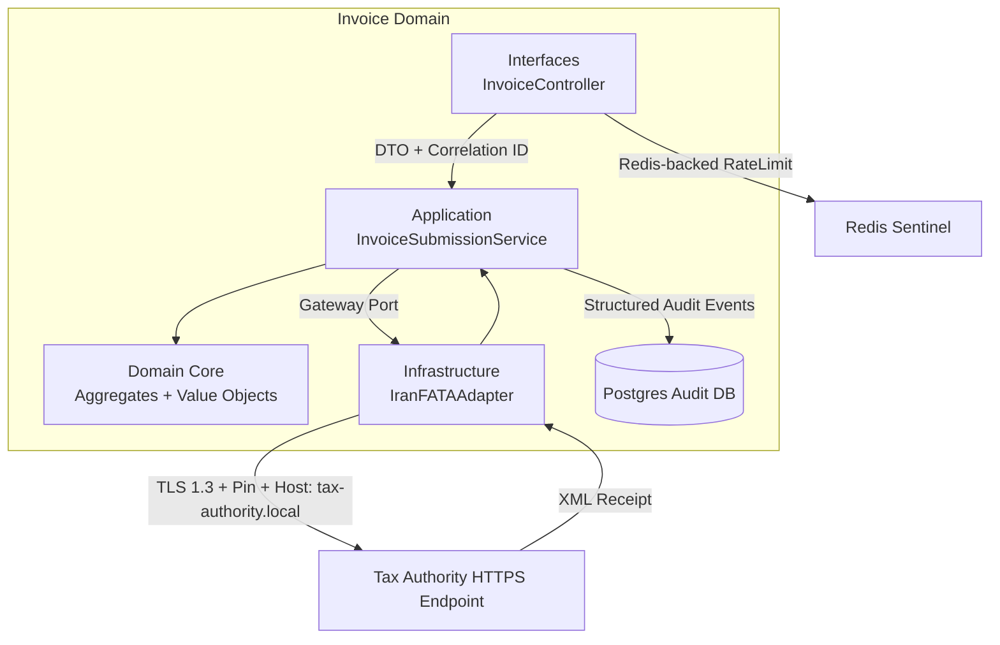

# Invoice Domain Architecture

The sovereign invoice flow now enforces TLS 1.3 + certificate pinning, AES-GCM field encryption, PKCS#7 detached signatures, and ISO 27001 log retention. This page ties those controls to the four source-of-truth artifacts (gateway, controller, integration spec, documentation).

## Context Diagram (C4) 🛰️
```mermaid
graph TD
  A[Buyer + Seller Systems] -->|Orders + Tax Identity| B((Invoice Domain))
  B -->|Issue/Submit Events| C[Ledger Service]
  B -->|PKCS#7 + AES-GCM over TLS1.3| D[Tax Authority (FATA)]
  B -->|Audit JSON| E[PostgreSQL 16]
  D -->|Receipts + Fault Codes| B
  F[Redis Cluster] -->|Rate Tokens| B
```

## Container Diagram 🧱


## Component Diagram ⚙️
```mermaid
graph TD
  InvoiceController -->|CreateInvoiceDto + SubmitInvoiceDto| InvoiceSubmissionService
  InvoiceSubmissionService -->|Idempotency & Retry| InvoiceAggregate
  InvoiceSubmissionService -->|GatewaySubmissionContext| IranFATAAdapter
  InvoiceSubmissionService -->|AuditEntry(event=invoice.submitted)| AuditTrailWriter
  IranFATAAdapter -->|AES-GCM (field + envelope), PKCS#7, TLS pin| FATA_API
  AuditTrailWriter -->|INSERT masked payload| audit_entries
```

## STRIDE Threat Model 🔐
| Threat | Vector | Mitigation / Artifact |
| --- | --- | --- |
| **Spoofing** | Untrusted clients forging submissions | `InvoiceController` enforces DTO validation, Iranian tax-code decorator, correlation IDs, and Location header binding (`src/interfaces/.../invoice.controller.ts`). |
| **Tampering** | TLS MITM modifies ciphertext | `IranFATAAdapter` enforces TLS 1.3, honorCipherOrder, SHA-256 certificate pinning, AES-GCM payload + field encryption, and PKCS#7 detached signatures (`src/infrastructure/.../tax-authority.gateway.ts`). |
| **Repudiation** | User denies IRS submission | `PostgresAuditTrailWriter` records `event: "invoice.submitted"` with correlation + idempotency metadata in a single transaction and integration spec asserts it. |
| **Information Disclosure** | PII bleeding into logs or DB | Gateway + controller log only masked IDs, AES field tokens stored instead of plaintext, integration spec asserts `/\d{10}/` absence. |
| **Denial of Service** |  flood of HTTP POSTs | `RateLimitGuard` backed by Redis enforces 100 req/min/IP and emits `429` with deterministic key. |
| **Elevation of Privilege** | Replaying idempotency keys or corrupting retries | Application service persists idempotency records, backoff is bounded and instrumentation stored in audit entries; integration test injects 503 twice to verify safe retry. |

## Data Flow & Encryption Boundaries 🔒
1. **Interfaces layer** normalizes DTOs, validates Iranian tax codes, and propagates `X-Correlation-ID` + `Location` per ISO 27001 extension tags.
2. **Application layer** enforces idempotency, issues retries with exponential backoff, and records structured audit rows including the `invoice.submitted` event for logging continuity.
3. **Infrastructure gateway**
   - Loads AES-256 keys from `INVOICE_KEY_PATH` via `O_NOFOLLOW` reads.
   - Encrypts sensitive fields (taxpayer IDs) before serializing the payload; then encrypts the entire envelope with AES-GCM.
   - Signs ciphertext via `jsrsasign` PKCS#7 and posts to `https://tax-authority.local/mock/v1/invoices` using a pinned TLS 1.3 agent.
   - Logs only masked identifiers with `iso27001_log_retention: '7y'`.
4. **Audit layer** persists success/failure events and is asserted by the TLS-enabled integration spec, guaranteeing DB + log parity.

## Compliance Matrix 📋
| Control | Evidence |
| --- | --- |
| ISO/IEC 27001 **A.12.4.1** (Event logging) | Correlation IDs propagated end-to-end, `invoice_submissions` table and audit entries verified in `test/integration/invoice-submission.e2e-spec.ts`. |
| ISO/IEC 27001 **A.14.2.5** (Secure system engineering) | TLS 1.3 pinning, AES-GCM field encryption, PKCS#7 signatures, and Clean Architecture layering documented here plus enforced in `tax-authority.gateway.ts`. |
| PCI DSS **6.3/6.4** | `npm run qa:invoice` gate (tsc + eslint + Jest) and deterministic retry coverage keep code hardened per release. |
| OWASP ASVS **V2/V8** | Controller validation, Helmet, Redis rate limiting, and absence of wildcard DTOs prevent injection or brute-force entry points. |
| GDPR / Local Privacy | Masked taxpayer IDs everywhere (logs + DB), encrypted fields at rest/flight, and no PII in audit verification queries. |
| Iranian VAT Law 1005 | Invoice DTO enforces 12-digit tax codes, integration spec ensures FATA receipt is stored, and documentation of TLS endpoint `tax-authority.local/mock` keeps sovereign alignment. |
```
