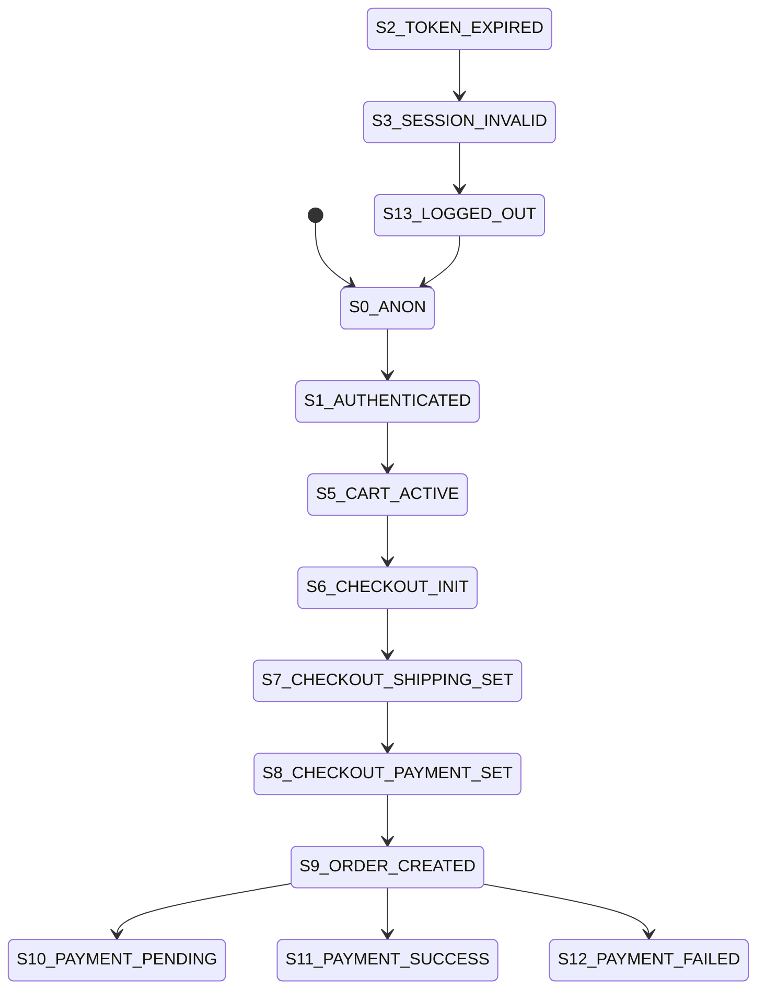

# Auth / Cart / Checkout State Machine Runbook

## Policy
No feature may be merged if it introduces a transition not defined in this document.

## State Diagram (Canonical)
- S0_ANON
- S1_AUTHENTICATED
- S2_TOKEN_EXPIRED
- S3_SESSION_INVALID
- S4_CART_EMPTY
- S5_CART_ACTIVE
- S6_CHECKOUT_INIT
- S7_CHECKOUT_SHIPPING_SET
- S8_CHECKOUT_PAYMENT_SET
- S9_ORDER_CREATED
- S10_PAYMENT_PENDING
- S11_PAYMENT_SUCCESS
- S12_PAYMENT_FAILED
- S13_LOGGED_OUT
- S_ERR

## Allowed Transitions
- S0_ANON -> S1_AUTHENTICATED | S_ERR | S13_LOGGED_OUT
- S1_AUTHENTICATED -> S2_TOKEN_EXPIRED | S4_CART_EMPTY | S5_CART_ACTIVE | S13_LOGGED_OUT | S_ERR
- S2_TOKEN_EXPIRED -> S1_AUTHENTICATED | S3_SESSION_INVALID | S_ERR
- S3_SESSION_INVALID -> S13_LOGGED_OUT | S_ERR
- S4_CART_EMPTY -> S2_TOKEN_EXPIRED | S5_CART_ACTIVE | S13_LOGGED_OUT | S_ERR
- S5_CART_ACTIVE -> S2_TOKEN_EXPIRED | S4_CART_EMPTY | S6_CHECKOUT_INIT | S13_LOGGED_OUT | S_ERR
- S6_CHECKOUT_INIT -> S2_TOKEN_EXPIRED | S7_CHECKOUT_SHIPPING_SET | S_ERR | S13_LOGGED_OUT
- S7_CHECKOUT_SHIPPING_SET -> S2_TOKEN_EXPIRED | S8_CHECKOUT_PAYMENT_SET | S_ERR | S13_LOGGED_OUT
- S8_CHECKOUT_PAYMENT_SET -> S2_TOKEN_EXPIRED | S9_ORDER_CREATED | S_ERR | S13_LOGGED_OUT
- S9_ORDER_CREATED -> S2_TOKEN_EXPIRED | S10_PAYMENT_PENDING | S11_PAYMENT_SUCCESS | S12_PAYMENT_FAILED | S_ERR | S13_LOGGED_OUT
- S10_PAYMENT_PENDING -> S2_TOKEN_EXPIRED | S11_PAYMENT_SUCCESS | S12_PAYMENT_FAILED | S13_LOGGED_OUT | S_ERR
- S11_PAYMENT_SUCCESS -> S2_TOKEN_EXPIRED | S13_LOGGED_OUT | S_ERR
- S12_PAYMENT_FAILED -> S2_TOKEN_EXPIRED | S13_LOGGED_OUT | S_ERR
- S13_LOGGED_OUT -> S0_ANON | S1_AUTHENTICATED | S_ERR
- S_ERR -> S0_ANON | S1_AUTHENTICATED | S4_CART_EMPTY | S5_CART_ACTIVE | S13_LOGGED_OUT

| From | To (Allowed) |
|---|---|
| S0_ANON | S1_AUTHENTICATED, S_ERR, S13_LOGGED_OUT |
| S1_AUTHENTICATED | S2_TOKEN_EXPIRED, S4_CART_EMPTY, S5_CART_ACTIVE, S13_LOGGED_OUT, S_ERR |
| S2_TOKEN_EXPIRED | S1_AUTHENTICATED, S3_SESSION_INVALID, S_ERR |
| S3_SESSION_INVALID | S13_LOGGED_OUT, S_ERR |
| S4_CART_EMPTY | S2_TOKEN_EXPIRED, S5_CART_ACTIVE, S13_LOGGED_OUT, S_ERR |
| S5_CART_ACTIVE | S2_TOKEN_EXPIRED, S4_CART_EMPTY, S6_CHECKOUT_INIT, S13_LOGGED_OUT, S_ERR |
| S6_CHECKOUT_INIT | S2_TOKEN_EXPIRED, S7_CHECKOUT_SHIPPING_SET, S_ERR, S13_LOGGED_OUT |
| S7_CHECKOUT_SHIPPING_SET | S2_TOKEN_EXPIRED, S8_CHECKOUT_PAYMENT_SET, S_ERR, S13_LOGGED_OUT |
| S8_CHECKOUT_PAYMENT_SET | S2_TOKEN_EXPIRED, S9_ORDER_CREATED, S_ERR, S13_LOGGED_OUT |
| S9_ORDER_CREATED | S2_TOKEN_EXPIRED, S10_PAYMENT_PENDING, S11_PAYMENT_SUCCESS, S12_PAYMENT_FAILED, S_ERR, S13_LOGGED_OUT |
| S10_PAYMENT_PENDING | S2_TOKEN_EXPIRED, S11_PAYMENT_SUCCESS, S12_PAYMENT_FAILED, S13_LOGGED_OUT, S_ERR |
| S11_PAYMENT_SUCCESS | S2_TOKEN_EXPIRED, S13_LOGGED_OUT, S_ERR |
| S12_PAYMENT_FAILED | S2_TOKEN_EXPIRED, S13_LOGGED_OUT, S_ERR |
| S13_LOGGED_OUT | S0_ANON, S1_AUTHENTICATED, S_ERR |
| S_ERR | S0_ANON, S1_AUTHENTICATED, S4_CART_EMPTY, S5_CART_ACTIVE, S13_LOGGED_OUT |

## Forbidden Transitions
- S0_ANON -> S6_CHECKOUT_INIT (anonymous checkout)
- S4_CART_EMPTY -> S9_ORDER_CREATED (order without cart)
- S6_CHECKOUT_INIT -> S8_CHECKOUT_PAYMENT_SET (shipping bypass)
- S3_SESSION_INVALID -> S1_AUTHENTICATED without login/register/refresh success

| Forbidden | Why Block |
|---|---|
| S0_ANON -> S6_CHECKOUT_INIT | Prevent anonymous checkout |
| S4_CART_EMPTY -> S9_ORDER_CREATED | Prevent order without line items |
| S6_CHECKOUT_INIT -> S8_CHECKOUT_PAYMENT_SET | Prevent shipping bypass |
| S3_SESSION_INVALID -> S1_AUTHENTICATED (without auth success) | Prevent session hijack/recovery bypass |

## Guard Definitions
- `route_protection_guard`: blocks `/cart`, `/checkout`, `/orders`, `/profile` without access token.
- `auth_refresh_guard`: refresh must succeed to recover from token expiry.
- `checkout_guard`: checkout steps must be sequential and server-validated.
- `payment_gateway_guard`: payment failure must be explicit and auditable.
- `checkout_step_guard` (backend domain): enforces deterministic session-step transitions:
  - `SHIPPING -> PAYMENT` only via `setShippingAddress`
  - `PAYMENT -> REVIEW` only via `setPaymentMethod`
  - `REVIEW -> COMPLETE` only via `completeCheckout`
  - any other step mutation is hard-failed with `checkout_step_transition_forbidden`

## Structured Transition Logging
Every transition event must log:
- `prev`
- `next`
- `reason`
- `guard` (only for blocked transitions)
- `guardReason` (blocked transition trigger reason)
- optional `details` (order id, http status, message)

Emission channels:
- browser structured console logs
- UI telemetry event stream (`flow_transition`, `guard_blocked`)
- backend structured logs (`checkout_transition`, `checkout_guard_blocked`, `checkout_side_effect`)

## Example Invalid Flows
- Anonymous user directly loads `/checkout` and reaches submit
- Checkout payment step set before shipping step
- Checkout success page without `orderId` / `orderNumber`

## Transition Assertion Layer (E2E)
- Must assert no `S6_CHECKOUT_INIT -> S8_CHECKOUT_PAYMENT_SET`.
- Must assert anonymous `/checkout` request cannot reach checkout states.
- Must assert `S9_ORDER_CREATED` includes `orderId` and `orderNumber` in transition details.
- Must assert HTTP `401` leads to `S2_TOKEN_EXPIRED` and not direct `S_ERR`.

## Audit Strategy
- Persist transition events in telemetry sink.
- Sample production logs for guard-block events.
- Alert on repeated forbidden transitions by path and reason.

## Failure Recovery Model
- 401 from API -> S2_TOKEN_EXPIRED -> refresh attempt.
- refresh fail -> S3_SESSION_INVALID -> S13_LOGGED_OUT.
- checkout/payment server failure -> S_ERR with explicit message and retry path.
- backend cleanup failure (`checkout_state_cleanup_untracked`) is treated as catastrophic:
  order reconciliation must run before retrying client-visible success.
